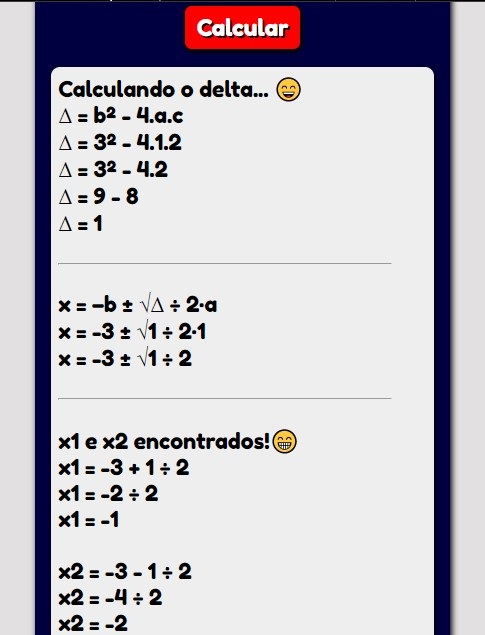

# Calculadora Bhaskara


### Ajustes e melhorias

O projeto ainda está em desenvolvimento e as próximas atualizações serão voltadas nas seguintes tarefas:

- [ ] Concluir todas etapas da fórmula
- [x] Remoção de erros
- [ ] Botões extras 
- [x] Regras de sinais
- [x] Versão adaptada para telas menores
- [ ] Copy to Clipboard

## 🚀 Instalando Calculadora Bhaskara


Para instalar o nosso projeto, siga estas etapas:

Linux e macOS:
```
git clone https://github.com/xRev3rse/CalculadoraBhaskara
```

## 🤝 Colaboradores

Agradecemos às seguintes pessoas que contribuíram para este projeto:

<table>
  <tr>
    <td align="center">
      <a href="#">
        <br>
        <sub>
          <a href="https://github.com/reysmalldev"><b>ReySmallDev</b></a>
        </sub>
      </a>
    </td>
  </tr>
</table>


## 😄 Seja um dos contribuidores<br>

Quer fazer parte desse projeto? Me chame no Whatsapp! (número na README do perfil)
